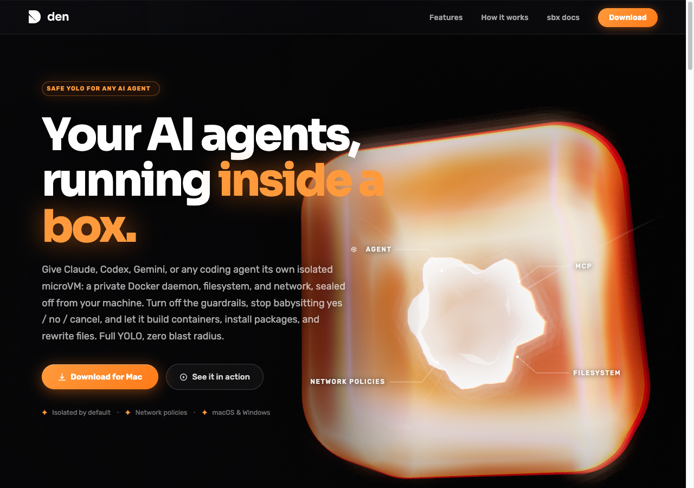

<p align="center">
  
</p>

<h1 align="center">den — landing page</h1>

<p align="center">Let your AI agents run full YOLO, safely.</p>

---

Marketing landing page for **den**, which runs any AI coding agent inside a
disposable, network-policed box. Give Claude, Codex, Gemini, Antigravity, or any
agent its own isolated microVM — a private Docker daemon, filesystem, and network,
sealed off from your machine. Turn off the guardrails, stop babysitting
yes / no / cancel prompts, and let it run unattended with zero blast radius.

## Preview



## Getting started

This is a static site — no build step required. Open `index.html` directly, or
serve it locally:

```bash
python3 -m http.server 8000
# then visit http://localhost:8000
```

## Structure

| Path | Description |
| --- | --- |
| `index.html` | The landing page |
| `mockup.html` | Earlier full mockup |
| `explorations/` | Design explorations and alternate versions |
| `resources/` | Logo, icons, and brand-mono agent logos |
| `screenshots/` | App and landing page screenshots |
